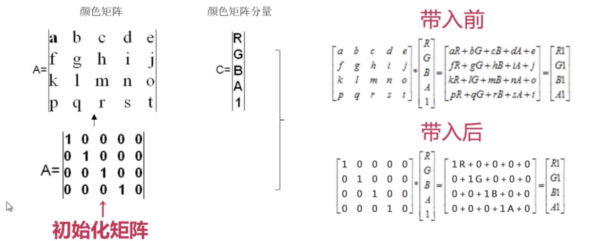
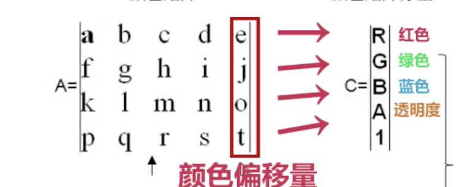

#Android 图像处理

##1 ARGB

###1 色调/色相
描述：物体传递的颜色

```java
ColorMatrix hueMatrix = new ColorMatrix();
hueMatrix.setRotate(0,50);//R
hueMatrix.setRotate(1,50);//G
hueMatrix.setRotate(2,50);//B 
```
###2 饱和度
描述：颜色的纯度，从0（灰）到100%（饱和）来进行描述

```java
ColorMatrix saturationMatrix = new ColorMatrix();
saturationMatrix.setSaturation(50);
```
###3 亮度/明度
描述：颜色相对明暗程度

```java
ColorMatrix lumMatrix = new ColorMatrix();
lumMatrix.setScale(50,50,50,1);
```
## 2 矩阵变换



```java
/**
  * Set this colormatrix to scale by the specified values.
  */
 public void setScale(float rScale, float gScale, float         bScale,float aScale) {
	final float[] a = mArray;
	for (int i = 19; i > 0; --i) {
		a[i] = 0;
	}
	a[0] = rScale;
	a[6] = gScale;
	a[12] = bScale;
	a[18] = aScale;
    }
```
```java
/**
  * Set the rotation on a color axis by the specified values.
  * <p>
  * <code>axis=0</code> correspond to a rotation around the RED color
  * <code>axis=1</code> correspond to a rotation around the GREEN color
  * <code>axis=2</code> correspond to a rotation around the BLUE color
  * </p>
  */
 public void setRotate(int axis, float degrees) {
	reset();
	double radians = degrees * Math.PI / 180d;
	float cosine = (float) Math.cos(radians);
	float sine = (float) Math.sin(radians);
	switch (axis) {
    	// Rotation around the red color
    	case 0:
       	mArray[6] = mArray[12] = cosine;
          mArray[7] = sine;
          mArray[11] = -sine;
          break;
      // Rotation around the green color
      case 1:
          mArray[0] = mArray[12] = cosine;
          mArray[2] = -sine;
          mArray[10] = sine;
          break;
      // Rotation around the blue color
        case 2:
          mArray[0] = mArray[6] = cosine;
          mArray[1] = sine;
          mArray[5] = -sine;
          break;
      default:
          throw new RuntimeException();
        }
}
```
```java
 /**
   * Set the matrix to affect the saturation of colors.
   *
   * @param sat A value of 0 maps the color to gray-scale. 1 is identity.
   */
 public void setSaturation(float sat) {
     reset();
     float[] m = mArray;

     final float invSat = 1 - sat;
     final float R = 0.213f * invSat;
     final float G = 0.715f * invSat;
     final float B = 0.072f * invSat;

     m[0] = R + sat; m[1] = G;       m[2] = B;
     m[5] = R;       m[6] = G + sat; m[7] = B;
     m[10] = R;      m[11] = G;      m[12] = B + sat;
}
```
#####从上面代码可以看出ColorMatrix就是使用矩阵对图像处理

#####如下矩阵为"复古风格" 
||||||
|---:|---:|---:|---:|---:|
|0.393|0.769|0.189|0|0|
|0.349|0.686|0.168|0|0|
|0.272|0.534|0.131|0|0|
|0|0|0|1|0|